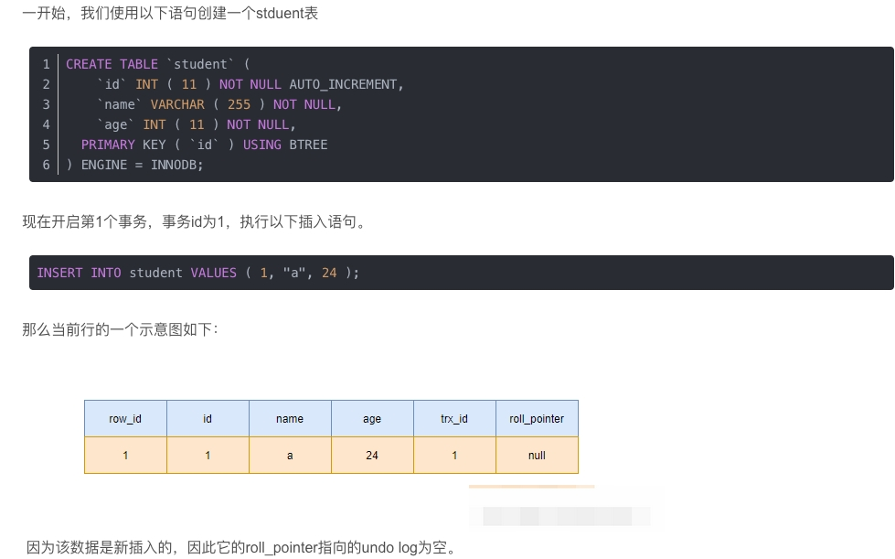
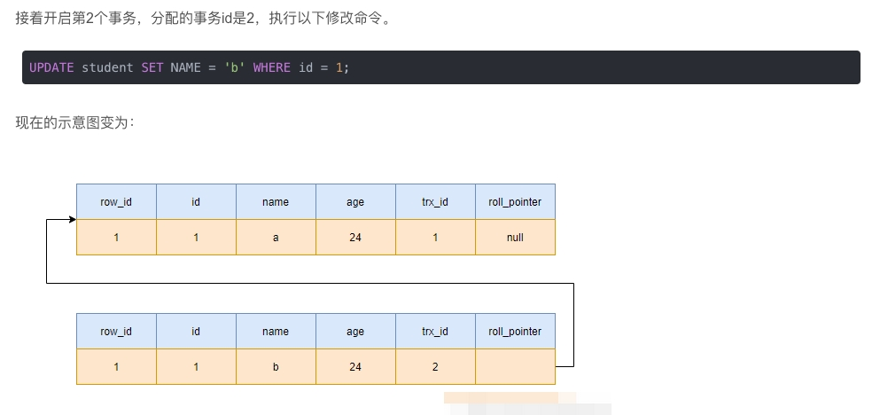
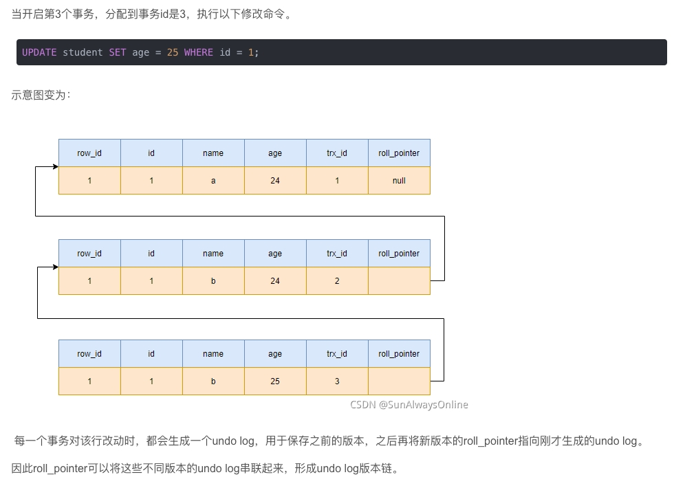
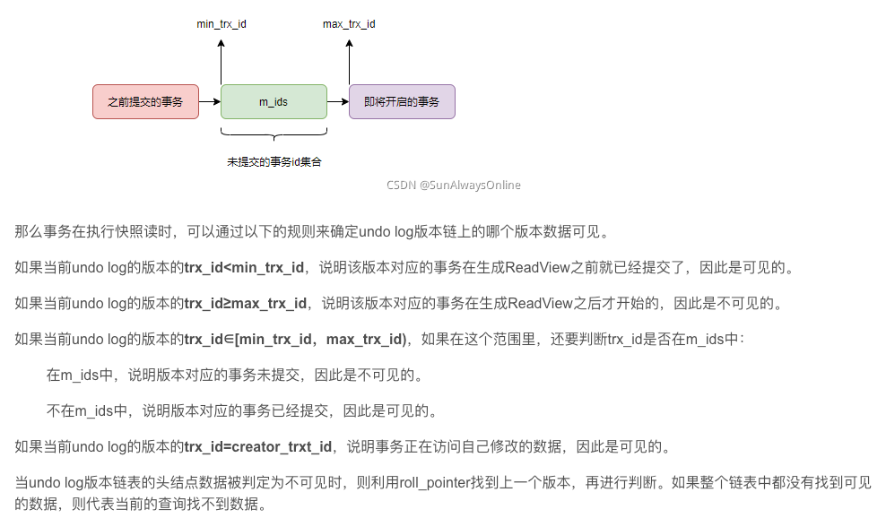

# 1.ACID 

# 2.关注的问题： 
    1. drity read, 
    2. non repeatable read, 
    3. phandom read

# 3.处理问题的手段
读锁，共享锁
写所，排它锁

# 4.transaction isolation level
| isolation level      | problem       | solutions     |
|----------------------|---------------------|---------------|
|READ UNCOMMITTED | dirty read/ no repeatable read / phandom read | |
|READ COMMITTED |  no repeatable read / phandom read | MVCC|
|REPEATABLE READ|  phandom read | add readLock when read|
|Serializable||add Gap lock |

## GAP Lock

简单查询： where col1 = xx

col1 唯一索引 ：
        xx存在： 锁xx行
        xx不存在：锁xx行上-下
    非唯一索引:
        锁xx行上-下

范围查询: where col1 > xx and col1 < yy
        下限 = xx存在? xx  :  [xx
        上线 = yy存在? yy  :  yy]

## MVCC (Multi-Version-Concurrent-Control)

链接：https://blog.csdn.net/qq_33591903/article/details/120927753

### 数据库的每行记录除了放真实的数据之外，还存着3个隐藏列：rowId,tx_id,roll_pointer

#### 1.rowId 也叫clustered index key 或者innodb internal ID
1. 默认以主键为rowId
2. 没有主键，则按字段顺序找一个非空的整数类型唯一索引作为rowId.
3. 如果没有找到，则自动生成一个自动增长的整数作为row_id

#### 2. trx_id 事务号
1. 当一个事务执行前，mysql会为该事务分配一个全局自增的事物ID.
2. 之后对该事务的增删改操作时，都会将自己的事务ID记录到trx_id中

#### 3.roll_pointer 回滚指针
1. 事务对当前行进行改动时，会将旧数据写入undo log中，再将新数据写入当前行，然后将当前行的roll_pointer指针指向刚才写入undo log的旧数据，因此可以通过roll_pointer找到改行的上一个版本。
2. 当一直有事务改动时，就会生成undoLog,最终形成undo log版本链

-------------

### undo log 版本链

 **每一个事务对该行改动时**，都会生成一个undo log，用于保存之前的版本，之后再将新版本的roll_pointer指向刚才生成的undo log。

----------

### readView 一致性视图

> 快照读: 简单的select, 即不包括 select ... lock in share mode, select ... for update, 可能会读到历史版本

> 当前读: 以下语句都是当前读，总是读到最新版本，并对最新的版本进行加锁(加锁后就不能追加undo log 版本链了，除非加锁的事务commit)
> - select ... lock in share mode
> - select ... for update
> - insert
> - delete
> - update 

在事务执行每一个快照读或事务初次执行快照读时，会生成一致性视图，即ReadView。

ReadView的作用是，判断undo log版本链中的哪些数据对当前事务可见。

ReadView包含的重要参数：(m_ids, min_trx_id, max_trx_id, creator_trx_id)

1. m_ids: 创建readView那一刻，所有的未提交事务ID集合
2. min_trx_id: m_ids中的最小值
3. max_trx_id: mysql为下一个事务所分配的trx_id，并不是m_ids的最大值
4. creator_trx_id: 创建此ReadView的事务ID

---------

##MVCC在四种隔离级别下的区别：

在Read Uncommitted级别下，事务总是读取到最新的数据，因此根本用不到历史版本

在Serializable级别下，事务总是顺序执行。写会加写锁，读会加读锁，完全用不到MVCC，所以MVCC也不在该级别下工作。

真正和MVCC兼容的隔离级别是Read Committed（RC）与Repeatable Read（RR）

MVCC在RC与RR级别下的区别，在于生成ReadView的频率不同：

1. 在RC级别下，当前事务总是希望读取到别的事务已经提交的数据，因此当前事务事务会在执行每一次快照读的情况下都会去生成ReadView，实时更新m_ids，及时发现那些已经提交的事务。

2. 在RR级别下，当前事务当然也能够读取到别的事务已经提交的数据，但为了避免不可重复读，因此只会在执行第一次快照读的情况下去生成ReadView，之后的快照读会一直沿用该ReadView。

